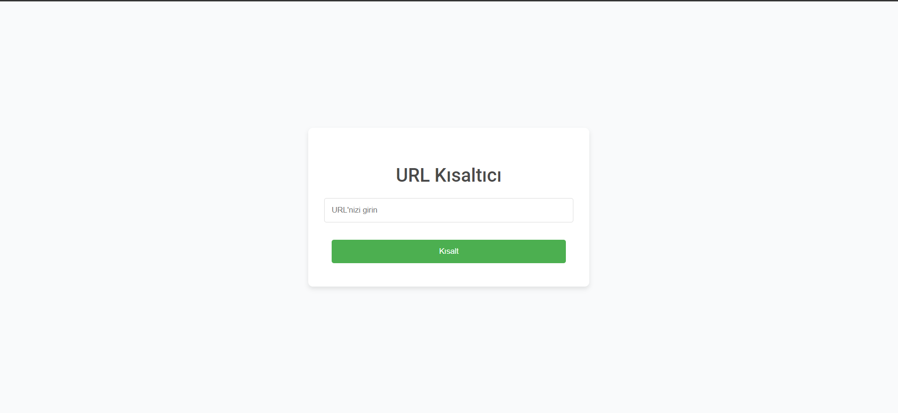
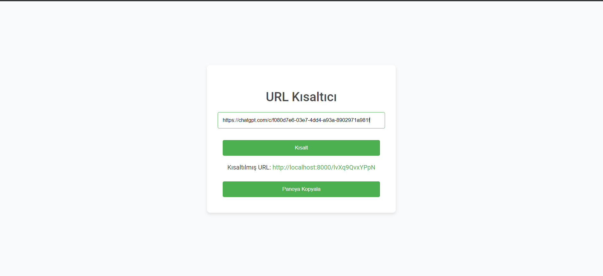

# URL Kısaltma Uygulaması

Bu proje, Laravel framework kullanarak geliştirilmiş bir URL kısaltma uygulamasıdır. Kullanıcılar uzun URL'leri kısa, kolayca paylaşılabilir bağlantılara dönüştürebilirler. Kısa URL'yi ziyaret eden biri, otomatik olarak orijinal URL'ye yönlendirilir.

## Özellikler

- Uzun URL'leri kısa ve benzersiz URL'lere dönüştürme
- URL'leri kısaltmadan önce doğrulama
- Bir URL'nin daha önce kısaltılmış olup olmadığını kontrol etme
- Kısa URL'lerden orijinal URL'lere yönlendirme

## Gereksinimler

- PHP >= 7.3
- Composer
- MySQL

## Kurulum

1. Depoyu klonlayın:

    ```bash
    git clone https://github.com/lutfubedel/MVC_Laravel_URL_Kisaltici.git
    cd MVC_Laravel_URL_Kisaltici
    ```

2. Bağımlılıkları yükleyin:

    ```bash
    composer install
    ```

3. Ortam değişkenlerinizi ayarlayın:

    `.env.example` dosyasını `.env` olarak kopyalayın ve veritabanı ayarlarını güncelleyin:

    ```env
    DB_CONNECTION=mysql
    DB_HOST=127.0.0.1
    DB_PORT=3306
    DB_DATABASE=url_shortener
    DB_USERNAME=root
    DB_PASSWORD=
    ```

4. Uygulama anahtarını oluşturun:

    ```bash
    php artisan key:generate
    ```

5. Veritabanı migrasyonlarını çalıştırın:

    ```bash
    php artisan migrate
    ```

6. Geliştirme sunucusunu başlatın:

    ```bash
    php artisan serve
    ```

7. Tarayıcınızı açın ve `http://localhost:8000` adresini ziyaret edin.

## Kullanım

1. Ana sayfada, uzun bir URL'i metin giriş alanına yapıştırın.
2. "Kısalt" düğmesine tıklayın.
3. URL geçerliyse, giriş alanının altında kısaltılmış URL'i göreceksiniz.
4. Orijinal URL'ye erişmek için kısaltılmış URL'i kullanın.

## Proje Yapısı

- `app/Http/Controllers/UrlController.php`: URL kısaltma ve yönlendirme işlemlerini yönetir.
- `app/Models/Url.php`: URL modeli.
- `database/migrations/*_create_urls_table.php`: `urls` tablosu için migrasyon dosyası.
- `resources/views/welcome.blade.php`: Uygulamanın ana görünümü.

## URL Doğrulama

URL'ler, Laravel'in `validate` metoduyla `url` kuralı kullanılarak doğrulanır ve doğru formatta olup olmadıkları kontrol edilir.

## Kısa URL Oluşturma

Kısa URL'ler, `Str::random` metodu kullanılarak 12 karakterlik bir dizi oluşturularak üretilir. Bu dizi büyük harfler, küçük harfler, rakamlar, tire ve alt tire içerir. Oluşturulan dizi, veritabanında benzersiz olup olmadığı kontrol edilir.

## Örnek

`https://example.com/very/long/url` adresini kısaltmak için, giriş alanına yapıştırın ve "Kısalt" düğmesine tıklayın. Örneğin, `http://localhost/AbCdEfGhIjKl` gibi bir kısa URL alabilirsiniz. `http://localhost/AbCdEfGhIjKl` adresini ziyaret ettiğinizde orijinal URL'ye yönlendirileceksiniz.

## Ekran Görüntüleri

Ana Sayfa:



Kısaltılmış URL:



## Lisans

Bu proje MIT Lisansı ile lisanslanmıştır.
